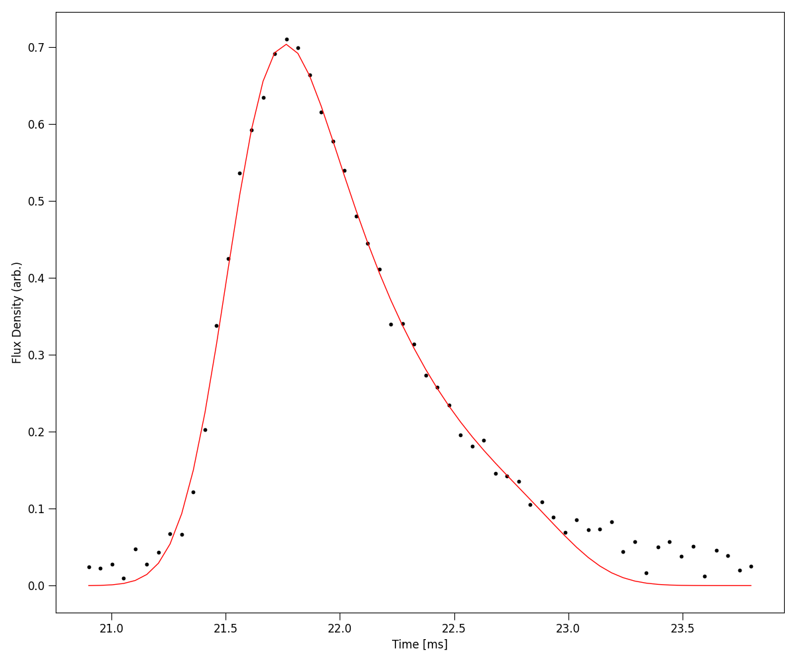
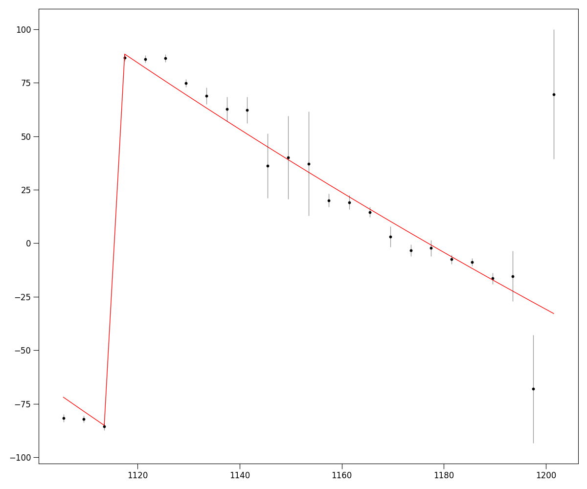
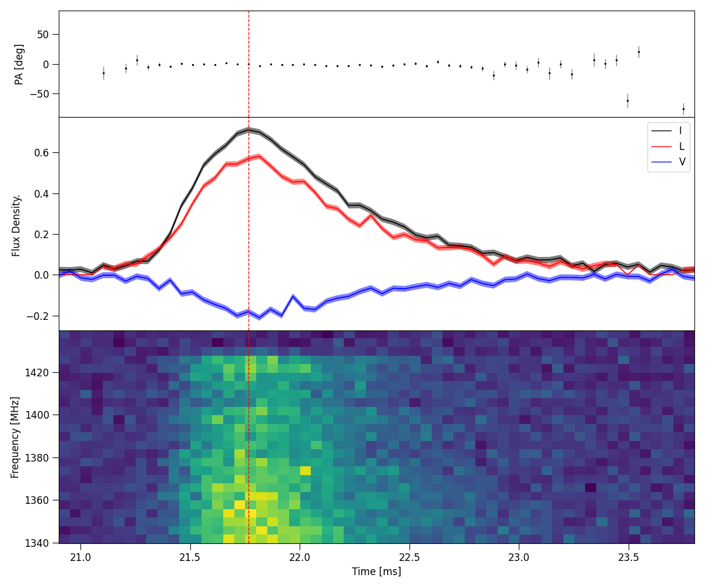

Advanced functions
------------------

Time series and time scatter Fitting
====================================

Following the last tutorial, load in the Power dynamic spectra data of 220610 and define a crop region.

.. code-block:: python

    from ilex.frb import FRB

    # initialise FRB instance and load data
    frb = FRB(name = "FRB220610", cfreq = 1271.5, bw = 336, dt = 50e-3, df = 4, t_crop = [20.9, 23.8],
                f_crop = [1103.5, 1200])
    frb.load_data(ds_I = "examples/220610_dsI.npy")  

A quick and dirty method for fitting the time series profile is using the ``least squares`` method. 

.. code-block:: python

    # fit
    frb.fit_tscatt(method = "least squares", plot = True)

In most cases, an FRB burst will be more complicated. In which case a more robust method using the ``bayesian``
toggle is nessesary. To do so, priors need to be given.

.. code-block:: python

    # priors
    priors = {'a1': [0.5, 0.8], 'mu1': [21.0, 22.0], 'sig1': [0.1, 1.0], 'tau': [0.01, 2.0]}

    # fit
    p = frb.fit_tscatt(method = "bayesian", priors = priors, plot = True)

We can also return the ``p``, the fitting utility class which has a number of useful features. Most notable is showing
the stats of the modelling.

.. code-block:: python

    p.stats()

.. code-block:: console

    Model Statistics:
    ---------------------------
    chi2:                         52.2002   +/- 10.2956
    rchi2:                        0.9849    +/- 0.1943
    p-value:                      0.5053
    v (degrees of freedom):       53
    free parameters:            5

    Bayesian Statistics:
    ---------------------------
    Max Log Likelihood:           127.7476  +/- 2.2624
    Bayes Info Criterion (BIC):   -235.1929 +/- 4.5248
    Bayes Factor (log10):         nan
    Evidence (log10):             48.0135   +/- 0.0980
    Noise Evidence (log10):       nan

Fitting RM and plotting Position Angle (PA) Profile
===================================================

We can fit for rotation measure (RM) and then plot polarisation properties. First we load in full stokes data.

.. code-block:: python

    # load in data
    frb.load_data(ds_I = "examples/220610_dsI.npy", ds_Q = "examples/220610_dsQ.npy",
                  ds_U = "examples/220610_dsU.npy", ds_V = "examples/220610_dsV.npy")

We will fit for the RM first. Once this method runs the fitted RM will be saved to the FRB instance class.

.. code-block:: python

    # fit RM
    frb.fit_RM(method = "RMsynth", terr_crop = [0, 15], t_crop = [21.4, 21.6], plot = True)

.. code-block:: console

    Fitting RM using RM synthesis
    RM: 217.9462  +/-  4.2765     (rad/m2)
    f0: 1137.0805274869874    (MHz)
    pa0:  1.0076283903583936     (rad)

Once RM is calculated, we can plot a bunch of polarisation properties using the master method ``.plot_PA()``.

.. code-block:: python

    frb.plot_PA(terr_crop = [0, 15], plot_L = True, plot = True)

Weighting data
==============

One Useful feature of ILEX is weighting. The ``frb.par.tW`` and ``frb.par.fW`` attributes are ``weights`` class instances that
can be used to respectivley weight data in time when making spectra, or weight data in frequency when making time profiles. The 
``weights`` class found in ``ilex.par`` has many methods for making weights, we will use ``method = func`` which will allow us
to define a weighting function. The plots below show the before and after of applying a set of time weights before scrunching in
time to form a spectra of stokes I.

.. code-block:: python
    # lets make a simple scalar weight that multiplies the samples in time
    # by -1 so we can see it works
    # lets plot the before and after 
    frb.plot_data("fI")     # before

    frb.par.tW.set(W = -1, method = "None")
    frb.plot_data("fI")     # after
    # NOTE: the None method is used to specify we want to take the values weights.W as 
    # the weights

.. image:: spec_before_W.png
   :width: 720pt

.. image:: spec_after_W.png
   :width: 720pt

We can be a little more creative with how we define our weights. Lets define a function based on the posterior of our time 
series profile we fitted before.

.. code-block:: python
    # import function to make scattering pulse function
    from ilex.fitting import make_scatt_pulse_profile_func

    # make scatt function based on number of pulses, in this case 1
    profile = make_scatt_pulse_profile_func(1)

    # define a dictionary of the posteriors of the fiting
    args = {'a1': 0.706, 'mu1': 21.546, 'sig1': 0.173, 'tau': 0.540}

    # another method of setting the weights in either time or frequency (xtype)
    frb.par.set_weights(xtype = "t", method = "func", args = args, func = profile)

    # now weight, The rest is left to you, why not plot it?

