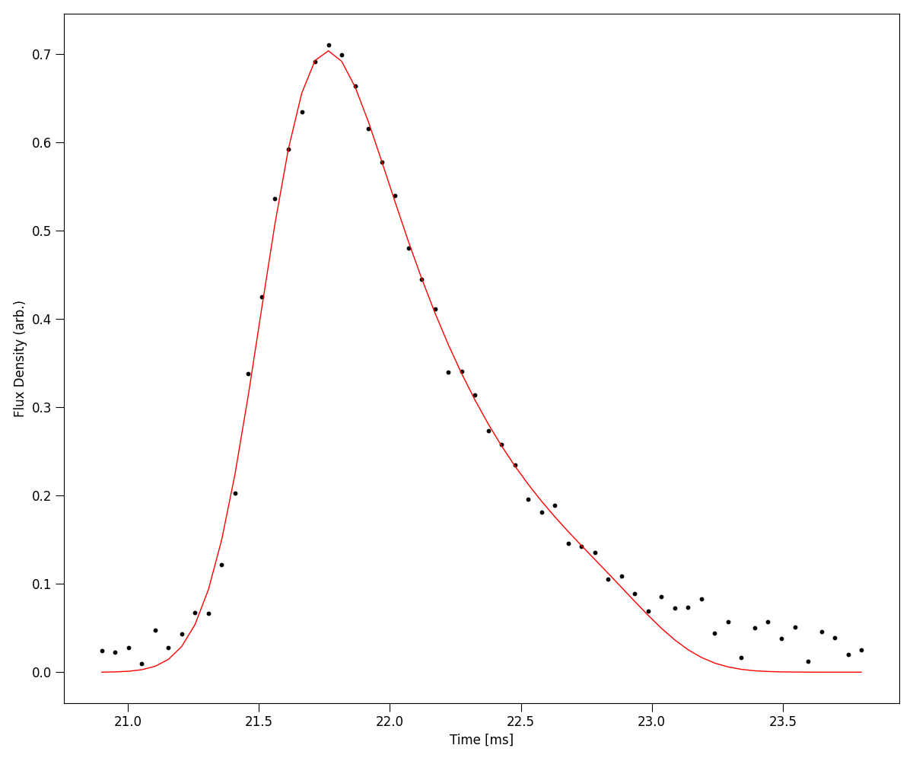
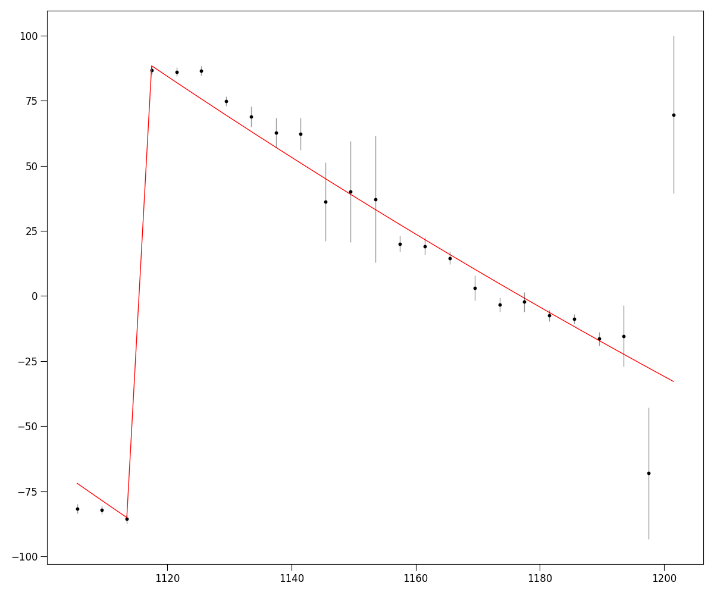
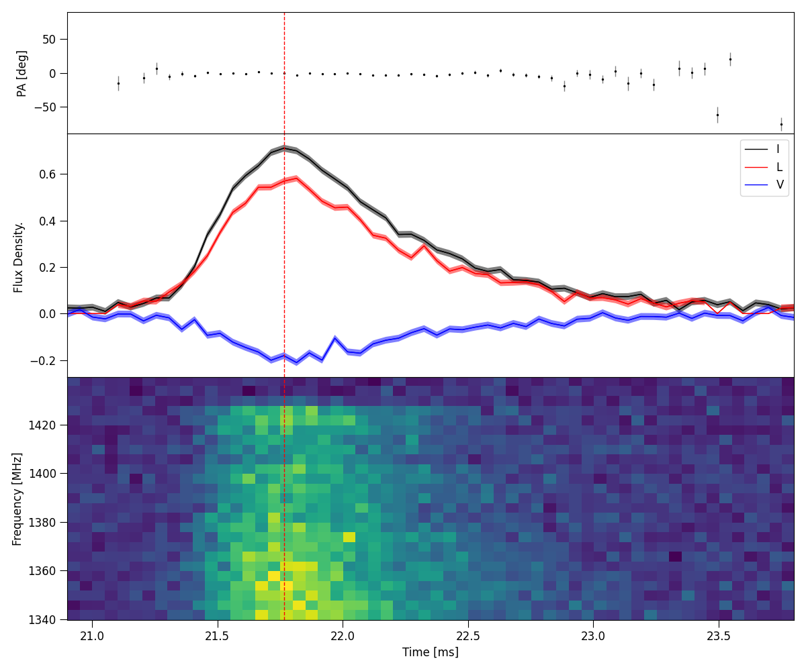

Tutorial 2: Fitting methods
------------------

In the second tutorial, we will breifly explore the methods we can use to fit various FRB parameters.

Scattering timescale
====================================

Following the last tutorial, load in the Power dynamic spectra data of 220610 and define a crop region.

.. code-block:: python

    from ilex.frb import FRB

    # initialise FRB instance and load data
    frb = FRB(name = "FRB220610", cfreq = 1271.5, bw = 336, dt = 50e-3, df = 4, t_crop = [20.9, 23.8],
                f_crop = [1103.5, 1200])
    frb.load_data(dsI = "examples/220610_dsI.npy")  

We can fit the time series burst as a sum of Gaussian pulses convolved with a common one-sided exponential

.. math::
   I(t) = \sum_{i = 1}^{N}\bigg[A_{i}e^{-(t-\mu_{i})^{2}/2\sigma_{i}^{2}}\bigg] * e^{-t/\tau},

where :math:`A_{i}, \mu_{i}` and :math:`\sigma_{i}` are the amplitude, position in time and pulse width 
in time of each :math:`i^{\mathrm{th}}` Gaussian and :math:`'*'` denotes the convolution operation.

This is implemented in the ``.fit_tscatt()`` method of the ``FRB`` class. The simplest way to call this 
function is to use a ``least squares`` fitting method. 

.. code-block:: python

    # fit
    frb.fit_tscatt(method = "least squares", show_plots = True)

In most cases, an FRB burst will be more complicated. In which case a more robust method using ``bayesian``
analysis is nessesary. To do so, priors need to be given. We also need to give our best estimate for the number
of pulses in the burst, which we can do with ``npulse``

.. code-block:: python

    # priors
    priors = {'a1': [0.5, 0.8], 'mu1': [21.0, 22.0], 'sig1': [0.1, 1.0], 'tau': [0.01, 2.0]}

    # fit
    p = frb.fit_tscatt(method = "bayesian", priors = priors, npulse = 1, show_plots = True)

In the above code, we set the priors of the single pulse with suffixes ``1``, i.e. ``a1`` for the amplitude of the 
first pulse, ``mu1`` for the position of the first pulse etc. If we had two pulses, we would also give priors for the amplitude
``a2``, position ``mu2`` etc. In general for each pulse ``N``, we specify its parameters ``aN, muN, sigN``. 
We can also return the ``p`` object, which is a fitting utility class which has a number of useful features, such as showing fitting 
statistics

.. code-block:: python

    p.stats()

.. code-block:: console

    Model Statistics:
    ---------------------------
    chi2:                         52.2002   +/- 10.2956
    rchi2:                        0.9849    +/- 0.1943
    p-value:                      0.5053
    v (degrees of freedom):       53
    free parameters:            5

    Bayesian Statistics:
    ---------------------------
    Max Log Likelihood:           127.7476  +/- 2.2624
    Bayes Info Criterion (BIC):   -235.1929 +/- 4.5248
    Bayes Factor (log10):         nan
    Evidence (log10):             48.0135   +/- 0.0980
    Noise Evidence (log10):       nan

Fitting RM and plotting Position Angle (PA) Profile
===================================================

We can easily fit for the rotation measure (RM). Ilex provides 3 different methods for doing so.

1. Quadratic fitting of the polarisation position angle (PA) ``method = "RMquad"``

.. math::
   \mathrm{PA(\nu) = RMc^{2}}\bigg(\frac{1}{\nu^{2}} - \frac{1}{\nu_{0}^{2}}\bigg),

where :math:`\nu_{0}` is the reference frequency. If this is not set, the central frequency ``cfreq``
will be used instead. 

2. Faraday Depth fitting through RM synthesis using the ``RMtools`` package ``method = "RMsynth"``

https://github.com/CIRADA-Tools/RM-Tools

3. QU-fitting using methods described in the following papers ``method = "QUfit"``

https://www.science.org/doi/abs/10.1126/science.aaw5903

https://arxiv.org/abs/2505.17497

First we load in the stokes ``Q`` and ``U`` dynamic spectrum and use the ``.fit_RM()`` method,
here we will use RM synthesis

.. code-block:: python

    # load in data
    frb.load_data(ds_Q = "examples/220610_dsQ.npy", ds_U = "examples/220610_dsU.npy")

    # fit RM
    frb.fit_RM(method = "RMsynth", terr_crop = [0, 15], t_crop = [21.4, 21.6], show_plots = True)

.. code-block:: console

    Fitting RM using RM synthesis
    RM: 217.9462  +/-  4.2765     (rad/m2)
    f0: 1137.0805274869874    (MHz)
    pa0:  1.0076283903583936     (rad)

The ``RM``, ``f0`` and ``pa0`` parameters will be saved to the ``.fitted_params`` attribute of the ``FRB`` class.
Once RM is calculated, we can plot a bunch of polarisation properties using the master method ``.plot_PA()``.

.. code-block:: python

    frb.set(RM = 217.9462, f0 = 1137.0805274869874)
    frb.plot_PA(terr_crop = [0, 15], stk2plot = "ILV", show_plots = True)

Scintillation bandwidth
=======================

We can also fit for the modulation index and decorrelation bandwdith of any scintillation present in the FRB data using the 
``.fit_scintband()`` method. The example data provided with the ILEX package is ill-suited for showing this method, however example code
is show below of how a user may fit for it.

.. code-block:: python
    
    frb.fit_scintband(method = "least squares", n = 3)

in the code above, we use the least squares algorithm to fit for scintillation. A unique feature of this method is that we can subtract out 
the broad spectral features of the FRB before fitting for scintillation, thus only fitting through the residuals. This is done by fitting the
broad spectral features using a polynomial of order ``n``, which the user must specify as an argument to the ILEX method. (**NOTE: subtracting out
the broad spectral features of the FRB can bias the decorrelation bandwdith that is fitted in some cases. Know exactly what you are fitting and why
before doing so!**)

