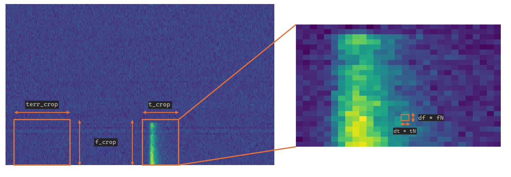

How does ILEX work?
-------------------

ILEX is primarily a toolkit for analysing High time resolution (HTR) Fast Radio Burst (FRB) data
produced by the CRAFT Effortless and Localisation and Enhanced Burst Inspection (CELEBI) pipeline.

CELEBI paper - https://www.sciencedirect.com/science/article/abs/pii/S2213133723000392
CELEBI github - https://github.com/askap-craco/CELEBI

However, fundamentally, ILEX will work with Stokes I, Q, U and V frequency and time dynamic spectra
regardless of context. 

Currently, ILEX only supports 2D numpy files ``.npy``. 

# The ``FRB`` class

The main class that you will be using is the ``FRB`` class. This class can be imported by running

.. code-block:: python

   from ilex.frb import FRB

This class has a variety of functions that can be used to plot, fit and manipulate Stokes data. Currently
the ``FRB`` class supports:

- manipulating data: including cropping, channel zapping
- processing data: including averaging, weighting, Faraday de-rotating, normalising
- Fitting the time series to a sum of Gaussian pulses convolved with a one-sided exponential tail 
- Deriving a decorrelation bandwidth
- Fitting the Rotation Measure (RM) using either Q/U fitting or RM synthesis
- Plotting data: including time series, frequency spectra, dynamic spectra, PA, poincare sphere

# Initialising the ``FRB`` class

Create a new instance of the ``FRB`` class. Here we can specify a number of parameters, I recommend 
at the very least setting ``cfreq`` and ``name``. Here we set ``cfreq``, the central frequency, to 
919.5 MHz

.. code-block:: python

   frb = FRB(name = "FRBtest", cfreq = 919.5)

We can also initialise the class using a config file,

.. code-block:: python

   frb = FRB(yaml_file = "config.yaml")

see the tutorial on FRB config files for more details.

To start using the ``FRB`` class, we need to load in data, there are 4 data products that can be loaded in,
``dsI, dsQ, dsU`` and ``dsV``, these represent the Stokes I, Q, U and V dynamic spectum. 

.. code-block:: python
   
   # loading in Stokes I dynamic spectrum
   frb.load_data(dsI = "dsI.npy")

# The ``FRB`` parameters

The parameters in the ``FRB`` class are split into 3 groups (for the most part...)

``par``      - parameters that are descriptive to the FRB data, such as name, intrinsic data resolution etc.
``metapar``  - meta parameters that describe the processing being done on the FRB data, such as time,freq crops, averaging etc.
``hyperpar`` - hyper parameters that describe the functionality of the class itself, such as if verbose printing, showing plots etc.

``frb.par`` is where you can find all the parameters of the FRB. 
``frb.metapar`` is where you can find all the meta parameters of the FRB.
Each hyper parameter is their own attribute in the FRB class, such as verbose, i.e. ``frb.verbose`` or show_plots, ``frb.show_plots``  

## ``par``

There are a number of parameters that can be set that for the most part are only descriptive of the FRB, these include

``name``        - The name of the FRB, this is used when saving plots as .png files
``RA``          - Right Ascension of FRB position (Metadata)
``DEC``         - Declination of FRB position (Metadata)
``DM``          - Dispersion Measure (Metadata)
``bw``          - Bandwidth of FRB observation
``MJD``         - Modified Julian Date [``days``] of burst (Metadata)
``cfreq``       - Central frequency [``MHz``] of bandwidth
``t_lim_base``  - Base limits of loaded FRB data in time [``ms``]
``f_lim_base``  - Base limits of loaded FRB data in freq [``MHz``] 
``t_ref``       - Zero-point of data in time [``ms``], i.e. reference point 
``nchan``       - Number of channels in Dynamic spectra
``nsamp``       - Number of time samples in Dynamic spectra
``dt``          - Intrinsic resolution of time samples in loaded Dynamic spectra
``df``          - Intrinsic resolution of freq channels in loaded Dynamic spectra
``RM``          - Rotation Measure
``f0``          - Reference frequency [``MHz``]
``pa0``         - Reference Polarisation Position Angle (PA)
``tW``          - Weights applied in time when averaging to make spectra
``fW``          - Weights applied in frequency when averaging to make time series

Note: Parameters labelled with (Metadata) are purely descriptive labels that are not used any where in ILEX (yet...).

## ``metapar``

These meta parameter control the processing of the FRB data, this includes

``t_crop``      - Crop of on-pulse data in time [``ms``] or in phase units
``f_crop``      - Crop of on-pulse/off-pulse data in frequency [``MHz``] or in phase units
``terr_crop``   - Crop of off-pulse data in time [``ms``] or in phase units. Used to estimate time and freq noise/errors
``tN``          - Averaging factor in time
``fN``          - Averaging factor in frequency
``norm``        - Normalisation
``zapchan``     - Channel zapping 

## ``hyperpar``

These hyper parameters control many of the class utilities. This includes

``verbose``     - Enable verbose printing, this will enable the logging features of ILEX
``plot_type``   - Type of plot when plotting 1D data, [``lines``] for line plots and [``scatter``] for scatter plots
``residuals``   - If true, plots of fitting results will also show residuals
``apply_tW``    - If true, will apply time weights [``tW``]
``apply_fW``    - If true, will apply freq weights [``fW``]
``zap``         - If true, the FRB data will be treated as if channels are zapped and will use numpy ``.nan`` functions when processing
``show_plots``  - If true, show any plot in an interactive window
``save_plots``  - If true, save any plot as a .png file
``crop_units``  - Control what units are used when cropping data, [``physical``] for ``ms/MHz`` or [``phase``] for phase units ``[0.0 - 1.0]``

All the above ``par``, ``metapar`` and ``hyperpar`` parameters can be set in a config file for ease of use and reproducibility. 

# How data is processed in the ``FRB`` class

ILEX by default will not load in the Stokes dynamic spectra files into memory all at once, they will be loaded in as
memory maps to the files on disk (see https://numpy.org/doc/stable/reference/generated/numpy.memmap.html). Every time 
the user requests some data, whether for plotting, fitting etc., ILEX will first define a "crop". This crop has two main
parameters, ``t_crop`` and ``f_crop``, these define the crop boundary in time [``ms``] and frequency [``MHz``] by default.
ILEX will then take this crop, and load in the data within this crop into memory. This makes ILEX extremely memory efficient
and in most cases quick as well, since that data will be cached when being used again. The image below illustrates this.

This crop is also refered to as the on-pulse crop, as such we try to capture the FRB within this crop. In addition to this crop,
we can also specify an off-pulse crop that will use off-pulse data to estimate the noise per time sample per frequency bin. This 
off-pulse crop uses the same ``f_crop`` parameter to crop in frequency and to specify the off-pulse crop in time we can use 
``terr_crop``.

Once the crop boundaries are defined, ILEX will process the data. Currently ILEX supports the following processing techniques:

## Averaging

We can average the data in both time in frequency, i.e. downsample by some factor. For example, if we want to downsample ``1us``
data to ``10us`` data, we can do this by specifying ``tN = 10``, same with frequency but using ``fN``.

## Channel zapping

We can zap any channels if there is bad RFI etc. We can do this by specifying ``zapchan``. For example, if we set 
``zapchan = "1100:1150"``, all the channels between 1100 MHz and 1150 MHz (inclusive) will be zapped and ignored during processing.
We can specify as many regions of frequency as we want, for example ``zapchan = 1100:1150, 1180:1220`` will now also zap the channels 
between 1180 MHz and 1220 MHz. We can also specify singular channels, ``zapchan = 1100:1150, 1160``, this will also zap the channel at
1160 MHz. 

NOTE: depending on ``df * fN`` this may not be perfectly precise. 

## Faraday de-rotating

We can de-faraday rotate the Stokes Q and U data by specifying ``RM`` and ``f0``. If ``f0`` is not set, then it will take the default
value of ``f0 = cfreq``, i.e. the central frequency.

## Weighting 

We can weight in time and frequency. When we specify time and frequency weights ``tW`` and ``fW``, these will only be applied when we 
are averaging the entire crop. For example, if we are making frequency spectra, we average over all the time bins, in this case the 
time weights ``tW`` will be applied. Same case for the frequency weights ``fW``.

We can set the weights using 

.. code-block:: python
   
   # setting frequency weights
   frb.set_weights(xtype = "t")

where ``xtype = "t" or "f"`` denotes if we are setting the time or frequency weights.

The following is a list of the types of weights we can apply.

### Define a list of weights to apply 

We can set a list of weights

.. code-block:: python

   frb.set_weights(xtype = "t", W = [1, 2, 3, 4,...])

just make sure the number of weights matches the number of time samples in your crop.
You can also just define a single scalar value, although this is less useful.

.. code-block:: python

   frb.set_weights(xtype = "t", W = 2)

### interpolation

We can define a set of weights along with ``x`` values that can be used to interpolate
between these weights, for example

.. code-block:: python

    # 1000 weights from 0 to 1
    W = np.linspace(0, 1.0, 1000)

    # x coordinate for weights
    x = np.linspace(1, 1000, 1000)

    # set weights, make sure to use interp method
    frb.par.set_weights(xtype = "t", W = W, x = x, method = "interp")

    # define a new set of x coordinate somewhere inbetween 1 and 1000
    x_int = np.linspace(401, 500, 100)

    # interpolate weights
    W_int = frb.par.tW.get_weights(x = x_int)
    
This is useful to define a set of weights for the full extent of an FRB or the dataset, this 
interpolation will then work with your crop.

### Define a weight function

We can also define a function that will when evaluated will produce weights that will be applied
directly to the data. This allows us to be creative. See the advanced ILEX Tutorial for an example 
:doc:`advanced_ilex`.

NOTE: Weights are applied after averaging in time or frequency using ``tN`` or ``fN``.

## normalising

We can also normalise the data if desired, although this hasn't been tested, so use at your own 
descretion. (This may be removed in a later version of ILEX, so probably don't rely on it too much)

``norm = max`` - normalise using maximum ``max()``
``norm = absmax`` - normalise using absolute maximum ``abs(max())``
``norm = None`` - Skip normalisation (default)

## Order of process operations

The order in which data is processed goes like this:

1. Crop in Time
2. Crop in freq
3. Channel zapping
4. normalise (may be removed)
5. Faraday de-rotate
6. Time average 
7. Freq average 
8. Time weights 
9. Freq weights
10. Produce data products, including noise/error products

# The Data products

When you load in any/all of the Stokes I, Q, U and V dynamic spectra you can also for a number
of data products. Lets look at an example using the ``.get_data()`` method.

.. code-block:: python

   data = frb.get_data(["dsI", "dsQ"], get = True)

This call to ``.get_data()`` is requesting a crop of the stokes I and Q dynamic spectra. This
will run through all the processing steps outlined aboved and spit out cropped and processing stokes 
I and Q dynamic spectra, denoted by the ``ds``. We also return these data products as a dict by specifying
``get = True``.

We can also ask for 1D time series data and/or spectra data

.. code-block:: python

   data = frb.get_data(["dsI", "dsQ", "tI", "fI"], get = True)

here we have also asked for the Stokes I 1D times series (denoted by the ``t``) and frequency spectra
(denoted by the ``f``).
When we ask for any 1D data products, if we have also defined the off-pulse crop using ``terr_crop``, the
``.get_data()`` method will also return the corrosponding noise/error products with the suffix ``err``, in 
this case ``tIerr`` and ``fIerr``. Additionally, the x-axis for the times series ``time`` and frequency spectra 
``freq`` will also be saved.

Any data product that is created will always be saved to the ``FRB`` class, for example 

``"dsI", "dsQ"`` will be saved to ``FRB._ds``, if you want to retrieve ``"dsI"``, you specify 
``FRB._ds["I"]``.

Similarly with time series, ``FRB._t`` and frequency spectra ``FRB._f``. In the case that you also want
the noise/error data as well, specify ``FRB._t["{S}err"]`` for any Stokes parameter ``S`` in the case for time
series noise (Same thing for frequency spectra). For the time series/freq spectra x-axis, specify ``FRB._time/FRB._freq``.

# data instances

Every time ``.get_data()`` is run, an instance of the ``frb.par`` and ``frb.metapar`` attributes are created
and labelled ``frb.this_par`` and ``frb.this_metapar`` respectivley. These parameters describe the processed
data at that very instance. These parameters may differ from the base parameters set in the ``FRB`` class depending
on if any of the ``par`` or ``metapar`` parameters were overwritten when calling an ``FRB`` class method, for example

.. code-block:: python

   frb.get_data(["dsI", "dsQ"], tN = 20)

in this example we have overwritten the ``tN`` parameter to 20. Thus if ``frb.this_metapar.tN`` will be 20
whilst the base value ``frb.metapar.tN`` will remain the same. This allows the user to quickly change any FRB/crop
parameters to explore the data without having to update a config file or the ``FRB`` class itself every time.

You can also change the ``hyperpar`` parameters (such as verbose), but these will be permanently changed. 

NOTE: you can also change any of these parameters permanently using ``FRB.set()``.

