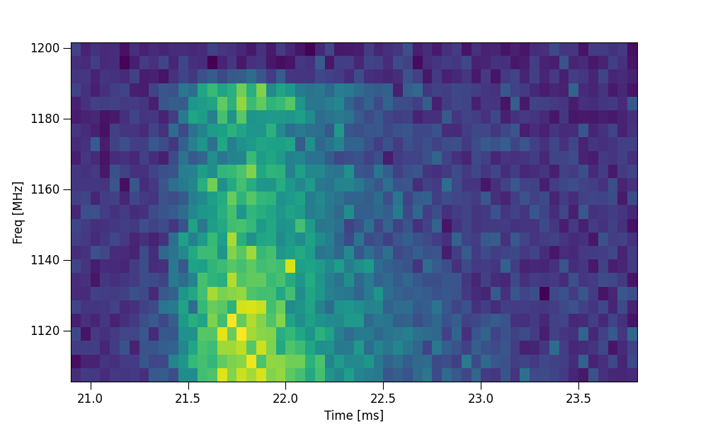

Using the FRB.yaml config file
------------------------------

Overview
========

For ease of use users have the option of creating an FRB config file that holds all the parameter, metaparameter, hyperparameter and
aditional plotting/fitting options that can easily be tweaked in one placed. These config files are also used in the 
additional ILEX scripts provided. A config file can be made by either using the make_FRBconfig.py script or by directly copying the 
``defaut.yaml`` file in ``ilex/files/``. An FRB config file looks something like the following:

.. code-block:: yaml

    data:  # file paths for stokes dynamic spectra
      dsI: "220610_dsI.npy"
      dsQ: "220610_dsQ.npy"
      dsU: "220610_dsU.npy"
      dsV: "220610_dsV.npy"

    par:   # parameters
      name:   "FRB220610"
      RA:     "00:00:00.0000"
      DEC:    "00:00:00.0000"
      DM:     0.0
      bw:     336
      MJD:    0
      cfreq:  1271.5
      t_lim_base:  [0.0, 3100.0]
      f_lim_base:  [0.0, 336.0]
      t_ref:  0
      nchan:  336
      nsamp:  0
      dt:     0.05
      df:     4.0
      RM:     null
      f0:     null
      pa0:    0.0

    metapar:   # metaparameters
      t_crop:     [20.9, 23.8]
      f_crop:     [1103.5, 1200]
      terr_crop:  null
      tN:         1
      fN:         1
      zapchan:    null
      norm:       "None"

    hyperpar:   # hyperparameters
      verbose:        False
      force:          False
      show_plots:     False
      save_plots:     True
      plot_type:  "regions"
      residuals:      True
      plotPosterior:  True

Using the FRB config file
=========================

An FRB config file can be used when either creating an FRB instance or when using the ``frb.load_data()`` method.

.. code-block:: python

    # import
    from ilex.frb import FRB

    # create FRB instance with config file
    frb = FRB(yaml_file = "examples/220610.yaml")

