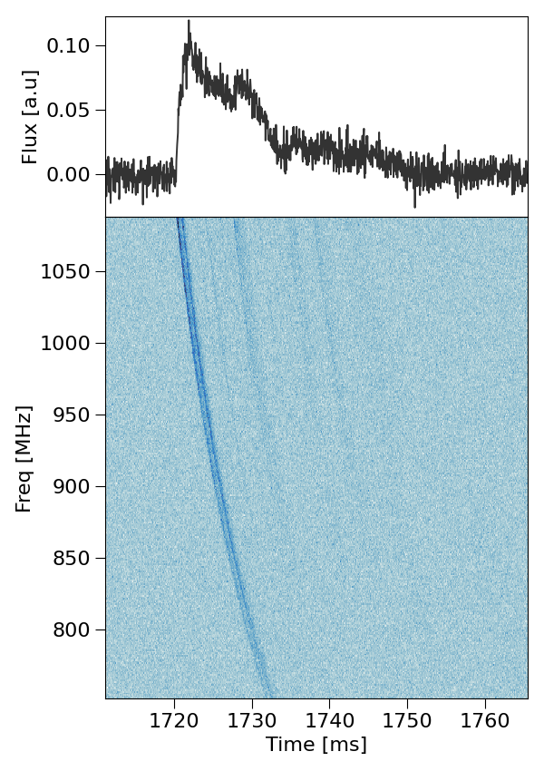
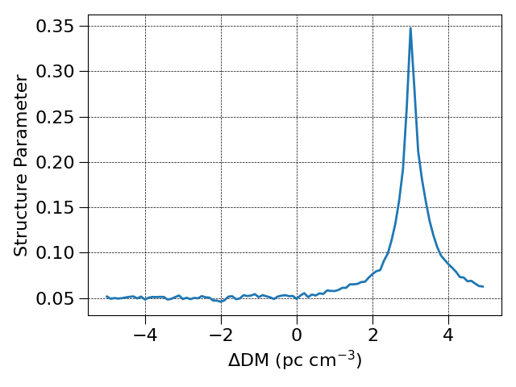
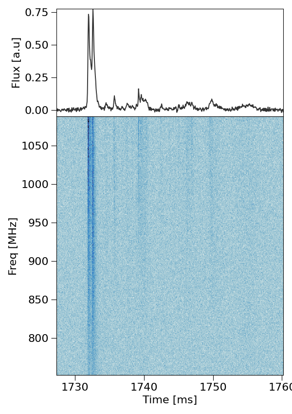

Dedisperse FRB data using ILEX and shrine
-----------------------------------------

The following is a guide to correcting the dispersion in an FRB using SHRINE. In this example we have ``X`` and ``Y`` voltage data for 
the FRB 20230708A [Dial et al, 2025] that are slightly under-despersed with a DM of ``408.51``. Hence, we will use SHRINE to find the structure maximised DM and apply 
this coherently.

Start by creating a config file for the FRB:

.. code-block:: console

   python3 -m make_config 230708.yaml

Set the nessesary parameters in the config file, 230708A has a central frequency of ``919.5`` MHz with a bandwidth of ``336`` MHz. :

.. code-block:: yaml

   data: # file paths for Stokes I, Q, U and V dynspec .npy files
    dsI: ./230708_I.npy

   par:
    cfreq: 919.5
    name: frb230708
    bw: 336

If needed, create the stokes I dynamic spectrum:

.. code-block:: console 

   python3 -m make_dynspec -x 230708_X.yaml -y 230708_Y.yaml --bline --ofile "230708"

Loading this config file in python and plotting the data provides the following:

.. code-block:: python 

   from ilex.frb import FRB 
   
   frb = FRB("230708.yaml")
   frb.plot_data(tN = 50)

The above image show the Stokes I dynamic spectrum and time-series at a resolution of 1 MHz and 0.05 ms. We can clearly see a frequency sweep 
meaning there is residual dispersion remaining in the FRB. 

What we can do is search for the delta DM nessesary to correct for this using the ``incoherent_dedisperse.py`` script and the ``--method=SMDM`` option. To improve
the speed of the algorithm as well as the robustness we will crop the data. From the figure above a good crop is between ``1700`` and ``1780`` ms, this holds all the 
FRB information and some of the baseline signal on either side. Also set the time resolution to something reasonable.

.. code-block:: python

   frb.set(t_crop = [1700, 1780], tN = 40)

   frb.save_data(save_yaml = True)

Saving the data this way will not create new data products, instead every time data is loaded from this config file only the crop will be processed.

Now run the dispersion search algorithm:

.. code-block:: console 

   python3 -m incoherent_dedisperse --parfile 230708.yaml --DMmin -5.0 --DMmax 5.0 --DMstep 0.1 --method SMDM

This command will produce the following output:

.. code-block:: console 

   Results for Structure maximising DM:
   ----------------------------------------
   begin maximise_structure summary
   FRB Label: SMDM
   Time Resolution: 40.0us
   kc: 363
        Forced kc: False
   Structure Maximising Delta DM: 2.9999999999999716
   Uncertainty in Structure Maximising Delta DM: 0.0/+0.1999999999999993

Looking in the creating ``./SMDM`` directory you fill find a figure labelled ``*_strcture_parameter.png`` which will look something like the following:

Note, changing the min and max DM bounds for the DM search and centering the peak in the above plot will help better estimate the uncertainty in the 
DM. Applying a delta DM of ``3.0`` gives a final DM of ``411.51`` which is the correct DM [Dial et al, 2025].

Finally, there are a number of options to actually apply the delta DM. You could simply add the ``--oparfile`` and ``-o`` options when calling ``incoherent_dedisperse.py`` 
to save dedispersed copies of the input data, this will also create a new config file that streamlines loading that data into ILEX.

OR, you can coherently dedisperse the original voltage data, lets do this! Run the ``coherent_dedisperse.py`` script:

.. code-block:: console 

   python3 -m coherent_dedisperse -x 230708_X.npy -y 230708_Y.npy -o 230708_de --DM 3.0 --cfreq 919.5 --bw 336 --f0 751.5

Now create Stokes I dynamic spectra and a new config file with the new dedispersed data products. The following is your final de-dispersed FRB:

Now you are all done!
   