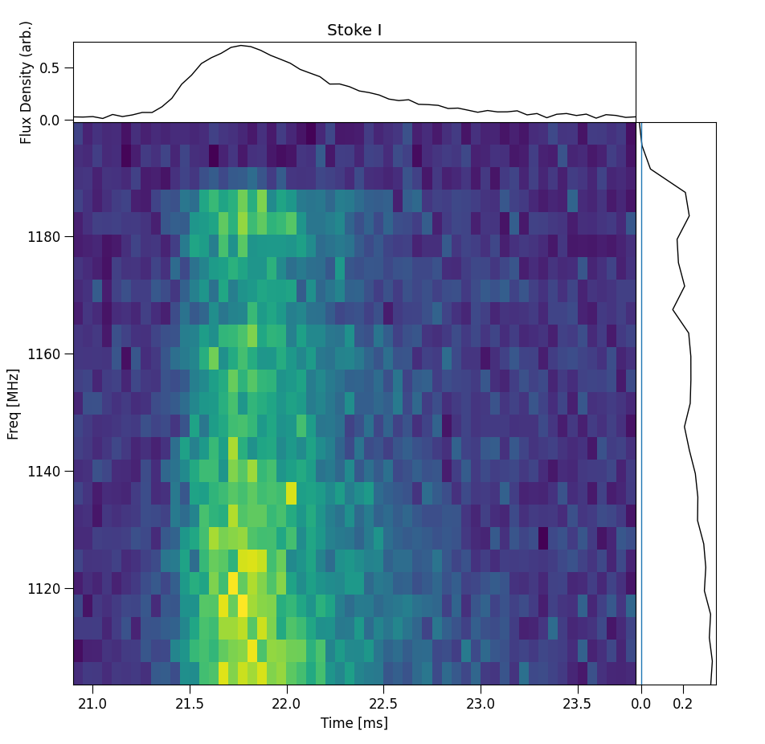

ILEX scripts
------------

The following is a list of scripts that can be used to either create new FRB dynamic spectra or create different plots. 
There are two ways to envoke these scripts. If you use the absolute filepath of these scripts, you can run them in the
bash console using

.. code-block:: console
   
   python3 <path>/scripts/plot_dynspec.py --options

where ``<path>`` is the installation directory of ILEX.
Or if you add the script directory to your PATH enviromental variable ``PATH=PATH:<path>/scripts/``

.. code-block:: console

   python3 -m plot_dynspec --options

In the following we will use the latter.

Quickly plot Dynamic spectra
============================

Quickly plot dynamic spectrum

.. code-block:: console

    python3 -m plot_dynspec filepath

    # options
    --tN 1       # averaging factor in time
    --fN 1       # averaging factor in frequency

Create Dynamic spectra from X and Y polarisations
=================================================

Create Dynamic spectrum from X and Y time series complex polarisations. Note by default only stokes I dynamic spectrum is made.

.. code-block:: console

    python3 make_dynspec.py 

    # options, data arguments
    -x filepath         # X polarisation filepath
    -y filepath         # Y polarisation filepath
    --nFFT 336          # Number of freq channels
    --bline             # Apply baseline correction
    --QUV               # make full stokes Dynamic spectrum
    --do_chanflag       # Do automatic channel flagging based on channel noise

    # data reduction arguments
    --sigma 5.0         # S/N threshold for baseline correction
    --baseline 50.0     # Width of rms crops in [ms]
    --tN 50             # Time averaging factor, helps with S/N calculation
    --guard 1.0         # Time between rms crops and burst in [ms]

    # Pulsar arguments (polarisation calibration, or for pulsar data)
    --pulsar            # enables pulsar folding
    --MJD0 None         # Initial Epoch MJD
    --MJD1 None         # Observation MJD
    --F0 None           # Initial Epoch pulsar frequency
    --F1 None           # Spin-down rate
    --DM None           # Dispersion Measure of Pulsar
    --cfreq 1271.5      # Central Frequency MHz
    --bw 336            # bandwdith MHz

    # output arguments
    --ofile filepath    # Name of new dynamic spectra, full output is filepath_{S}.npy where S is the stokes ds

Incoherently Dedisperse Stokes :math:`I, Q, U` or :math:`V` dynamic spectra
===========================================================================

Search for and apply a :math:`\Delta`DM (incoherently) or just apply a given :math:`Delta`DM to the passed
Stokes dynamic spectrum.

.. code-block:: console

    python3 -m incoherent_dedisperse

    # options
    -i filename         # Stokes dynamic spectrum, reference frequency assumed bottom of the band.
    --parfile filename  # ILEX .yaml file for pre-processing

    --dt 0.001          # Time resolution in [ms]
    --tN 1              # Time averaging factor
    --rfi               # Flag coarse RFI channels 
    --rfitN 1000        # Downsample factor to apply during RFI flagging 
    --thresh 3.0        # Threshold for RFI flagging 

    # DM arguments
    --DMmin -1.0        # Minimum of DM [pc/cm^3] range to search over
    --DMmax 1.0         # Maximum of DM [pc/cm^3] range to search over
    --DMstep 0.1        # Step size of DM [pc/cm^3]
    --fref "min"        # reference point along bandwidth to use as reference frequency     
    --method "simple"   # method to perform DM search 
    --quadfit           # Fit a quadratic to better optomise DM peak if using method = 'simple'
    --delDM             # Delta DM [pc/cm^3] to apply for dedispersion, if given will overide DM search 

    # shrine arguments 
    --force_kc None     # manually force k index cutoff for low pass filter, if not given, will estimate best value
    --filter_order 3    # low pass filter spectral index
    
    # bandwidth arguments
    --cfreq 919.5       # Central frequency [MHz] of Dynamic spectrum
    --bw 336            # Bandwidth [MHz] of Dynamic spectrum

    -o filename         # Output filename, No output saved if not specified
    --oparfile None     # Output ILEX file 

Coherently Dedisperse X and Y polarisation time series data
===========================================================

.. code-block:: console

    python3 -m coherent_dedisperse

    # options
    -x filepath         # X polarisation filepath
    -y filepath         # Y polarisation filepath
    --DM val            # Dispersion Measure pc/cm^3
    --cfreq val         # central frequency MHz
    --bw val            # bandwidth MHz
    --f0 val            # Reference frequency MHz
    --quick             # Apply dispersion using zero-padding to nearest optimal FFT length
    -o filepath         # Output filepath, full output is filepath_{X, Y}.npy for each polarisation

Make new FRB config file
========================

.. code-block:: console

    python3 -m make_config filepath 

    # options
    --celebi            # Make config file based on CELEBI output

Plot interactive Dynamic spectrum
=================================

Plots an interactive window with Dynamic spectrum, spectrum and time series profile. Note about this command, when cropping the dynamic
spectrum using the matplotlib cropping utility, the spectra and time series profile will update according the the crop. The following
example uses the ``examples/220610.yaml`` config file:

.. code-block:: console

    python3 -m plot_interactive_ds

    # options 
    --parfile filepath      # filepath of FRB config file
    -S                      # Stokes Dynamic spectrum to plot ["I", "Q", "U", "V"]

     

Pulse search
============

Search the Stokes total intensity data for the time/frequency bounds of the burst.

.. code-block:: console

    python3 -m findfrb

    # options
    -i filepath                     # Path to Stokes I dynamic sperctrum .npy
    --parfile filepath              # Optionally pass an ILEX config file path to set all these parameters

    # Coarse RFI flagging parameters
    --tN 1000                       # Time downsampling when performing corse RFI removal using statistical approach
    --thresh 3.0                    # Threshold for coarse RFI flagging
    --rfiter 1                      # number of iterations to performing
    --trop min,max                  # time crop to search for peak of burst

    # fluence width parameter
    --yfrac 0.95                    # Fraction of total fluence of burst for minimum width to encompass
    -w 100.0                        # Width of window [milliseconds] to search for FRB burst centered on peak in dynamic spectrum

    # spectrum flagging parameters 
    --fsig 3.0                      # Sigma threshold to apply to spectrum to get bounds

    --rmsw 10.0                     # RMS window length (For RFI subtraction)
    --fcrop_method minfluence       # method used to determine crop of burst in frequency
    --rfisub                        # Enable RFI subtraction
    --stDev 1                       # standard deviation in sample number for gaussian kernel smoothing to apply to time data

    # FRB parameters
    --dt 1e-3                       # Time resolution in [milliseconds]
    --cfreq 919.5                   # Central frequency in [MHz]
    --bw 336                        # bandwidth in [MHz]
    --Nband 0                       # Number of sub-bands to split up burst for sub-banded searching, set to 0 to disable this feature!

    # plotting
    -p                              # Plot results
    -v                              # plot more results (verbose plotting)
    --pw 200.0                      # Width of dynamic spectrum to plot (for diagnostic purposes only!)
    --pfN 1                         # Downsampling factor in frequency to apply when plotting dynspec

    # outputs
    -o "findfrb"                    # Output prefix for files and images
    --save_data                     # Save copy of cropped Stokes dynspec files with zapped RFI channels
    --oparfile "findfrb.yaml"       # Output ILEX yaml file 
    --cropds None                   # Crop full dynspec and only save a certain region [--cropds] centered on the located FRB [milliseconds]

Fit scattering index
====================

Fit the scattering index using a sub-banded process.

.. code-block:: console

    python3 -m fit_scattindex 

    # option, data arguments
    --parfile filepath      # ILEX config file (.yaml)
    -N 1                    # Number of sub-bands to split to fit scattering index 
    -v                      # Verbose mode, makes more diagnostic plots 
    -p                      # Show plots 
    -r                      # Redo sub-band fitting (removes cached files!)

    # outputs
    -o None                 # Output directory 
    -f None                 # Filename prefix

    # plotting arguments 
    --pw 150.0              # Width of dynspec to plot (visual purposes only!)
    --ptN 10                # Time downsampling of dynspec to plot (visual purposes only!)
    --pfN 4                 # Freq downsampling of dybspec to plot (visual purposes only!)

Calculate Cosmological Luminosity distance
==========================================

Calculate the luminosity distance of a source given it's redshift and a number of cosmological paramters.

.. code-block:: console

    python3 -m cosmo_history

    # options
    -z 0.1                  # Redshift of source

    --omega_m 0.315         # Matter density
    --omega_vac 0.685       # Vaccum Dark Energy density
    --H0 67.4               # Hubble Constant [km/s/Mpc]
    --K 0.0                 # Cosmological Curvature parameter
    --omega_r 0.0           # Radiation density
    --w -1.0                # Dark Energy Equation of State parameter (zeroth order)
    --wa 0.0                # Dark Energy Equation of State w(t) parameter (first order)
    --de_eos "constant"     # Dark Energy Equation of State quintessence model, default is constant w

    -N 1000000              # Number of samples for Numerical integration

Calculate FRB burst energetics
==============================

Calculate Luminosity, total energy and other energetics of an FRB burst. This script assumes A :math:`\Lambda`-CDM
cosmology.

.. code-block:: console

    python3 -m frb_energetics

    # options
    --fluence               # FRB Fluence [Jy ms]
    -z 0.1                  # Redshift of FRB (spectroscopic ideally)
    --bw 336                # Bandwidth of observation [MHz]
    --width 1.0             # Width of FRB [ms]
    --lumin_D None          # Luminosity distance [Mpc] (in case of near object - galactic), will overide redshift (z)

    --omega_m 0.315         # Matter density
    --omega_vac 0.685       # Dark Energy density
    --H0 67.4               # Hubbles constant [km/s/Mpc]

