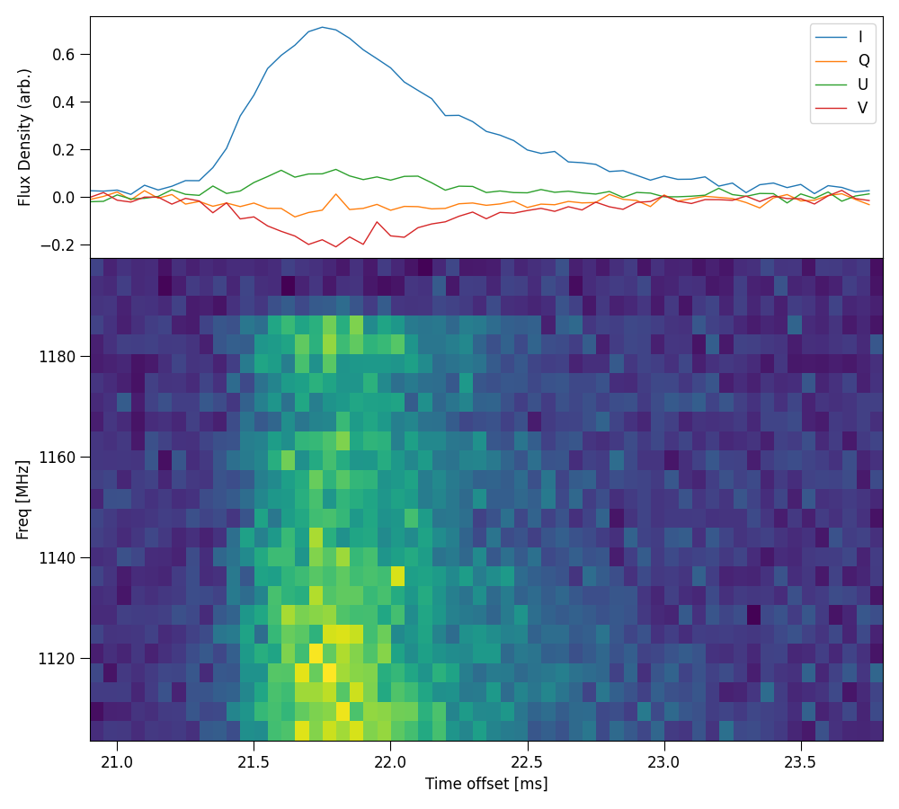
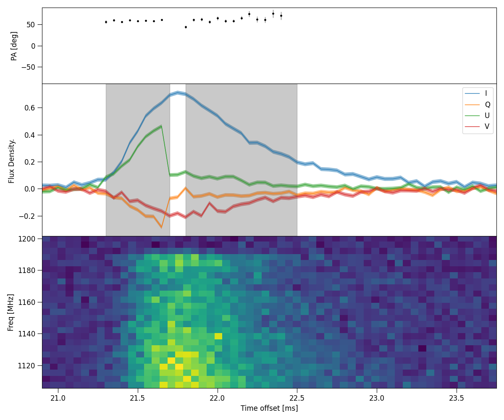

ILEX scripts
------------

The following is a list of scripts that can be used to either create new FRB dynamic spectra or create different plots. 
There are two ways to envoke these scripts. If you use the absolute filepath of these scripts, you can run them in the
bash console using

.. code-block:: console
   
   python3 <path>/scripts/plot_dynspec.py --options

where ``<path>`` is the installation directory of ILEX.
Or if you add the script directory to your PATH enviromental variable ``PATH=PATH:<path>/scripts/``

.. code-block:: console

   python3 -m plot_dynspec --options

In the following we will use the latter.

Quickly plot Dynamic spectra
============================

Quickly plot dynamic spectrum

.. code-block:: console

    python3 -m plot_dynspec filepath

    # options
    --tN 1       # averaging factor in time
    --fN 1       # averaging factor in frequency

Create Dynamic spectra from X and Y polarisations
=================================================

Create Dynamic spectrum from X and Y time series complex polarisations. Note by default only stokes I dynamic spectrum is made.

.. code-block:: console

    python3 make_dynspec.py 

    # options, data arguments
    -x filepath         # X polarisation filepath
    -y filepath         # Y polarisation filepath
    --nFFT 336          # Number of freq channels
    --bline             # Apply baseline correction
    --QUV               # make full stokes Dynamic spectrum
    --do_chanflag       # Do automatic channel flagging based on channel noise

    # data reduction arguments
    --sigma 5.0         # S/N threshold for baseline correction
    --baseline 50.0     # Width of rms crops in [ms]
    --tN 50             # Time averaging factor, helps with S/N calculation
    --guard 1.0         # Time between rms crops and burst in [ms]

    # Pulsar arguments (polarisation calibration, or for pulsar data)
    --pulsar            # enables pulsar folding
    --MJD0 None         # Initial Epoch MJD
    --MJD1 None         # Observation MJD
    --F0 None           # Initial Epoch pulsar frequency
    --F1 None           # Spin-down rate
    --DM None           # Dispersion Measure of Pulsar
    --cfreq 1271.5      # Central Frequency MHz
    --bw 336            # bandwdith MHz

    # output arguments
    --ofile filepath    # Name of new dynamic spectra, full output is filepath_{S}.npy where S is the stokes ds

Incoherently Dedisperse Stokes :math:`I, Q, U` or :math:`V` dynamic spectra
===========================================================================

Search for and apply a :math:`\Delta`DM (incoherently) or just apply a given :math:`Delta`DM to the passed
Stokes dynamic spectrum.

.. code-block:: console

    python3 -m incoherent_dedisperse

    # options
    -i filename         # Stokes dynamic spectrum, reference frequency assumed bottom of the band.

    --dt 0.001          # Time resolution in [ms]
    --tN 1              # Time averaging factor
    --DMmin -1.0        # Minimum of DM [pc/cm^3] range to search over
    --DMmax 1.0         # Maximum of DM [pc/cm^3] range to search over
    --DMstep 0.1        # Step size of DM [pc/cm^3]
    
    --cfreq 919.5       # Central frequency [MHz] of Dynamic spectrum
    --bw 336            # Bandwidth [MHz] of Dynamic spectrum
    --lower             # Use if first channel is bottom of the band

    -o filename         # Output filename, No output saved if not specified
    --delDM             # Delta DM [pc/cm^3] to apply for dedispersion, if given will overide DM search 

Coherently Dedisperse X and Y polarisation time series data
===========================================================

.. code-block:: console

    python3 -m coherent_dedisperse

    # options
    -x filepath         # X polarisation filepath
    -y filepath         # Y polarisation filepath
    --DM val            # Dispersion Measure pc/cm^3
    --cfreq val         # central frequency MHz
    --bw val            # bandwidth MHz
    --f0 val            # Reference frequency MHz
    --quick             # Apply dispersion using zero-padding to nearest optimal FFT length
    -o filepath         # Output filepath, full output is filepath_{X, Y}.npy for each polarisation

Make new FRB config file
========================

.. code-block:: console

    python3 -m make_config filepath 

    # options
    --celebi            # Make config file based on CELEBI output

Make FRB panel plot
===================

Make plot of various panels of FRB data

.. code-block:: console

    python3 -m plot_master

    # options
    --parfile filepath    # filepath of FRB config file
    --plot_panels "[S;D]" # panels to plot: P = PA profile, S = Stokes time profile, D = Dynamic spectrum, M = model of time series
                          # R = residual plot of model time series
    --model               # Model time series plot, if M panel given, will plot in seperate panel, else if S given, will plot in 
                          # stokes panel
    --modelpar filepath   # use sepereate yaml file to specify posteriors for plotting model time series
    --modelpulses         # plot each individual convolved gaussian
    --filename filepath   # Save figure in .png type format with given name

Here is an example of plotting the stokes time series and dynamic spectrum: 
.. code-block:: console

    python3 -m plot_master --parfile examples/220610.yaml --plot_panels "[S;D]"

Note: if you use a yaml file for the --modelpar option, the yaml file should look like the following:
.. code-block:: yaml

    posterior: {}       # where to put posterior of time series fit
    npulse: 1           # number of convolved gaussian pulses making time series fit

Plot stokes ds panels
=====================

Plot full panel of stokes dynamic spectrum with time series profilem, example uses the config file ``examples/220610.yaml``:

.. code-block:: console

    python3 -m plot_stokes_dynspec 

    # options
    --parfile filepath  # filepath of FRB config file
    --filename          # Save figure in .png type format with given name

.. image:: plot_dynspec_example.png
   :width: 720pt

Plot HTR mosaic
===============

Plot full mosaic of stokes dynamic spectrum with a variety of time resolutions.

.. code-block:: console

    python3 -m plot_dynspec_mosaic

    # options
    --parfile filepath                        # filepath of FRB config file
    -t 1 3 10 30 100 300 1000                 # Intergration times, list type
    --nsamp 100                               # halfwidth of crop to take around maximum point, in samples
    --tN 10                                   # Averaging factor in time, help find maximum and align spectrum
    --defaraday_ds                            # De-faraday rotate dynamic spectra, by default only the time series is rotated
    --filename filepath                       # Save figure in .png type format with given name

Here is an example plotting the intergration times 1, 10 and 50, these are actually time averaging factors, the true intergration
time will be ``t * dt`` where ``dt`` is specified in the config file.

.. code-block:: console

    python3 -m plot_dynspec_mosaic --parfile examples/220610.yaml -t 1 10 50 --nsamp 20 --tN 1 

.. image:: plot_mosaic_example.png
   :width: 720pt

Plot interactive Dynamic spectrum
=================================

Plots an interactive window with Dynamic spectrum, spectrum and time series profile. Note about this command, when cropping the dynamic
spectrum using the matplotlib cropping utility, the spectra and time series profile will update according the the crop. The following
example uses the ``examples/220610.yaml`` config file:

.. code-block:: console

    python3 -m plot_interactive_ds

    # options 
    --parfile filepath      # filepath of FRB config file
    -S                      # Stokes Dynamic spectrum to plot ["I", "Q", "U", "V"]

     
.. image:: plot_interactive_example.png
   :width: 720pt

Plot Multi-Component PA plot
============================

Plot multiple components, fit RM and plot PA profile along with stokes time series and dynamic spectrum. The following
example uses the ``examples/220610.yaml`` config file:

.. code-block:: console

    python3 -m plot_PA_multi

    # options
    --parfile filepath      # filepath of FRB config file
    --RMplots               # Show grid of RM fits of each component
    --RMburst               # Plot varaiblility of RM across burst
    --showbounds            # Show bounds of each component
    --filename filepath     # Save figure in .png type format with given name

Example shown below. Note, the results are not ideal, in this case it doesn't make sense to split a single pulse into 2 components, 
this is only for demonstrative purposes.

.. code-block:: console

    python3 -m plot_PA_multi --parfile examples/220610.yaml --showbounds

Calculate Cosmological Luminosity distance
==========================================

Calculate the luminosity distance of a source given it's redshift and a number of cosmological paramters.

.. code-block:: console

    python3 -m cosmo_history

    # options
    -z 0.1                  # Redshift of source

    --omega_m 0.315         # Matter density
    --omega_vac 0.685       # Vaccum Dark Energy density
    --H0 67.4               # Hubble Constant [km/s/Mpc]
    --K 0.0                 # Cosmological Curvature parameter
    --omega_r 0.0           # Radiation density
    --w -1.0                # Dark Energy Equation of State parameter (zeroth order)
    --wa 0.0                # Dark Energy Equation of State w(t) parameter (first order)
    --de_eos "constant"     # Dark Energy Equation of State quintessence model, default is constant w

    -N 1000000              # Number of samples for Numerical integration

Calculate FRB burst energetics
==============================

Calculate Luminosity, total energy and other energetics of an FRB burst. This script assumes A :math:`\Lambda`-CDM
cosmology.

.. code-block:: console

    python3 -m frb_energetics

    # options
    --fluence               # FRB Fluence [Jy ms]
    -z 0.1                  # Redshift of FRB (spectroscopic ideally)
    --bw 336                # Bandwidth of observation [MHz]
    --width 1.0             # Width of FRB [ms]
    --lumin_D None          # Luminosity distance [Mpc] (in case of near object - galactic), will overide redshift (z)

    --omega_m 0.315         # Matter density
    --omega_vac 0.685       # Dark Energy density
    --H0 67.4               # Hubbles constant [km/s/Mpc]

