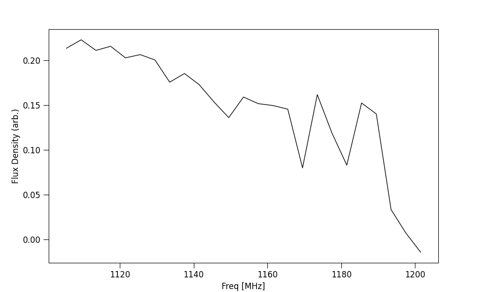
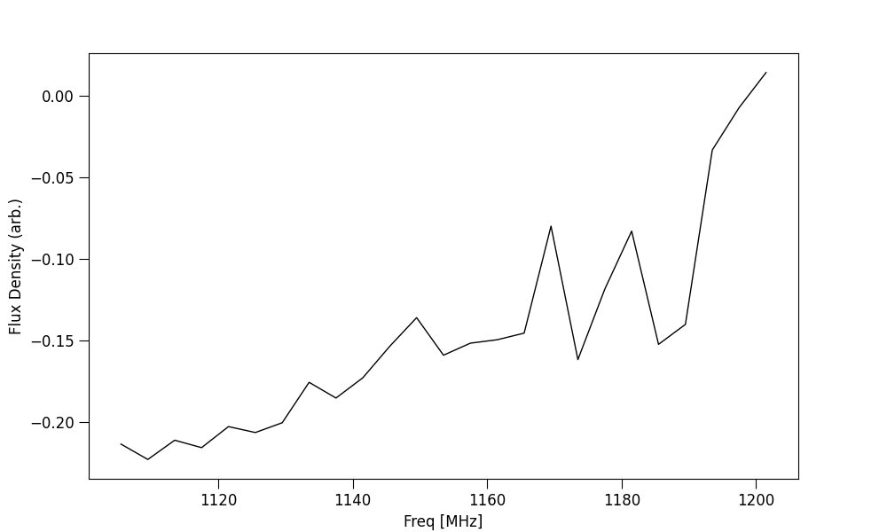

Tutorial 4: Weighting data in time/freq
---------------------------------------

This tutorial will walk through weighting data using ILEX.

Weighting data
==============

One Useful feature of ILEX is weighting. The ``frb.par.tW`` and ``frb.par.fW`` attributes are ``weights`` class instances that
can be used to respectivley weight data in time when making spectra, or weight data in frequency when making time profiles. The 
``weights`` class found in ``ilex.par`` has many methods for making weights, we will use ``method = func`` which will allow us
to define a weighting function. The plots below show the before and after of applying a set of time weights before scrunching in
time to form a spectra of stokes I.

.. code-block:: python

    # lets make a simple scalar weight that multiplies the samples in time
    # by -1 so we can see it works
    # lets plot the before and after 
    frb.plot_data("fI")     # before

    frb.par.tW.set(W = -1, method = "None")
    frb.plot_data("fI")     # after
    # NOTE: the None method is used to specify we want to take the values weights.W as 
    # the weights

We can be a little more creative with how we define our weights. Lets define a function based on the posterior of our time 
series profile we fitted before.

.. code-block:: python

    # import function to make scattering pulse function
    from ilex.fitting import make_scatt_pulse_profile_func

    # make scatt function based on number of pulses, in this case 1
    profile = make_scatt_pulse_profile_func(1)

    # define a dictionary of the posteriors of the fiting
    args = {'a1': 0.706, 'mu1': 21.546, 'sig1': 0.173, 'tau': 0.540}

    # another method of setting the weights in either time or frequency (xtype)
    frb.par.set_weights(xtype = "t", method = "func", args = args, func = profile)

    # now weight, The rest is left to you, why not plot it?