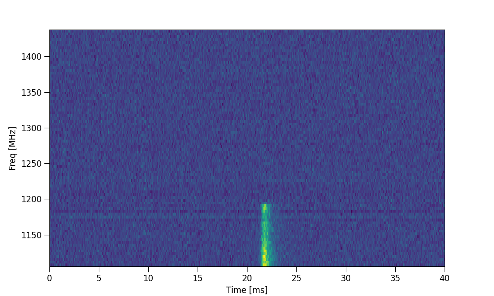
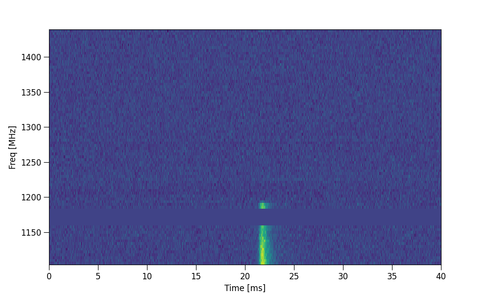
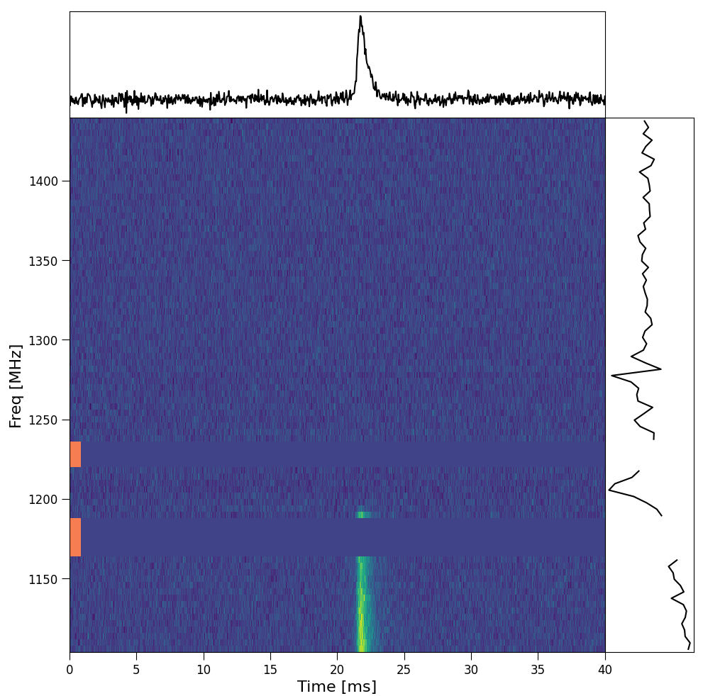

Tutorial 5: Channel zapping
---------------------------

This tutorial demonstrates how to flag/zap frequency channels in ILEX.

Channel zapping
===============

When working with radio data, often the case there will be Radio Frequency Interference (RFI)
that oversaturates the FRB signal in a given frequency channel/sub-band. Therefor it is important
to (in most cases) ignore these channels i.e. zap them from the FRB.

First, lests load in our data using a .yaml file. Then plot the data

.. code-block:: python

    # imports
    from ilex.frb import FRB

    frb = FRB("examples/220610.yaml")

    # lets plot the entire dataset
    frb.set(t_crop = ["min", "max"], f_crop = ["min", "max"])
    frb.plot_data("dsI")

As you can see, there are some not so great RFI between 1150 and 1200 MHz, lets try and zap them. We can do so by
setting the ``zapchan`` parameter

.. code-block:: python

    frb.set(zapchan = "1160:1180")

    frb.plot_data("dsI")

Now that RFI has been flagged and will be ignored when doing subsequent analysis, such as plotting the frequency spectra,
fitting ect. (**The** ``zapchan`` **parameter can also be set in the config file!**)

zapchan
=======

The ``zapchan`` parameter has a specific format that one must follow to properly zap channels. ``zapchan`` is a string that
specifies the range of frequencies (in MHz) that the user wishes to zap. For example, in the above example ``zapchan = 1160:1180`` 
zapped all the channels between 1160 and 1180 MHz **inclusive!**. You can specify multiple frequency ranges to zap, which we seperate with
``,``

.. code-block:: python

    frb.set(zapchan = "1160:1180, 1250:1300")

You can also zap single channels

.. code-block:: python

    frb.set(zapchan = "1250")

    # zap a single channel and a range of channels
    frb.set(zapchan = "1160:1180, 1250")

**NOTE: The** ``zapchan`` **string does not need to be in any particular order!**.

The ``.zap_channels()`` method allows for more utility in zapping channels. The simplest use case is appending the current ``zapchan`` 
string with additional frequency channels

.. code-block:: python

    frb.zap_channels("1250:1300")

you can also zap frequency channels that are close to zero by toggling ``zapzeros = True`` and specifying a tolerance threshold ``zapzerosmargin``

.. code-block:: python

    frb.zap_channels(zapzeros = True, zapzerosmargin = 1e-5)

you can also reset any additional channel zapping that was added after loading in the FRB data

.. code-block:: python

    frb.zap_channels(resetzap = True)

The ``.zap_channels()`` method also provides an interactive mode that allows the user to zap channels using an interactive GUI

.. code-block:: python

    frb.zap_channels(interactive = True)

   
   Interactive zapping GUI. Orange patches on LHS of dynamic spectra show 
   flagged channels, red lines show user defined region ready to zap.

**NOTE: The interactive zapping utility will automatically load in any prior zapping that has been applied.**

Loading in data with prior zapping
==================================

If any data that is loaded in, already has zapping applied, ILEX will detect these channels and update ``zapchan`` accordingly. ILEX does this 
by checking which frequency channels in the dynamic spectrum are set to ``np.nan``.

