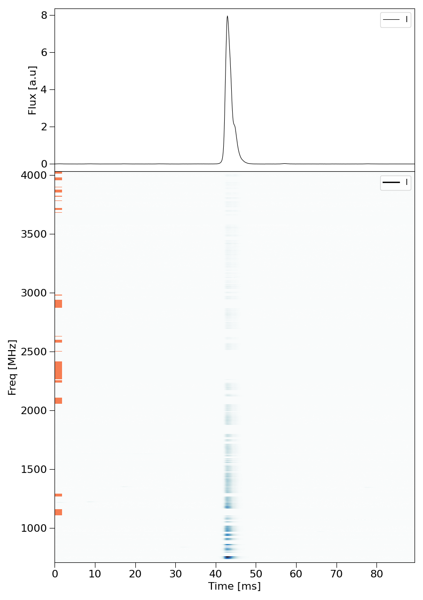
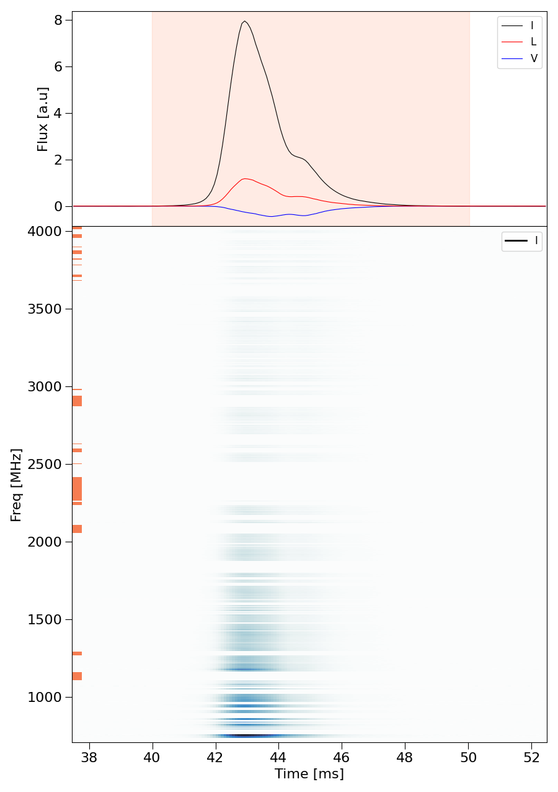
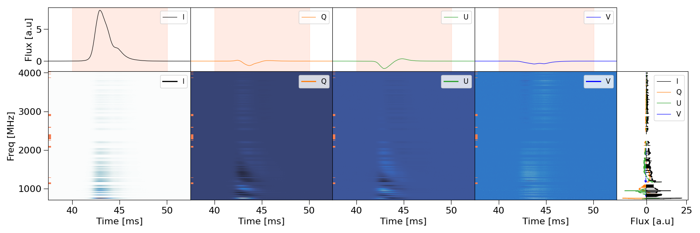
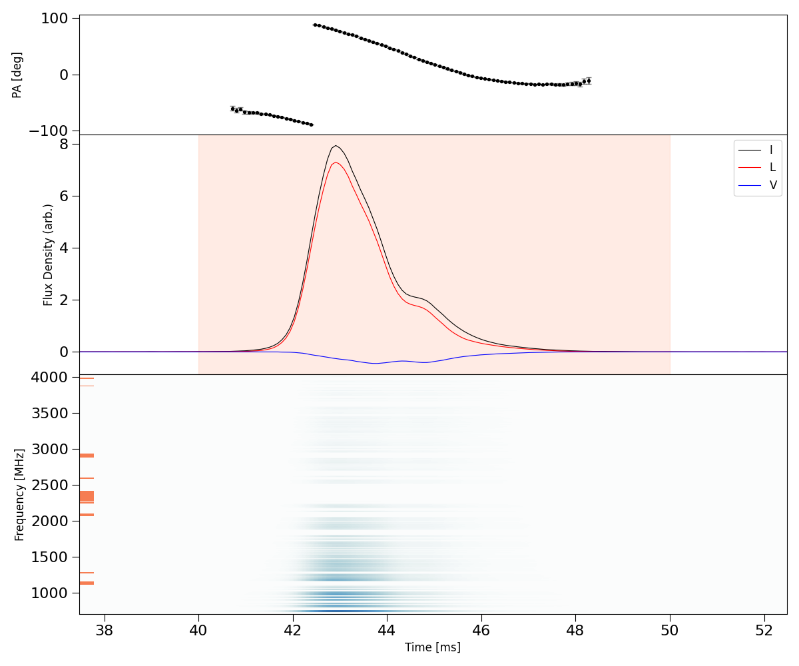
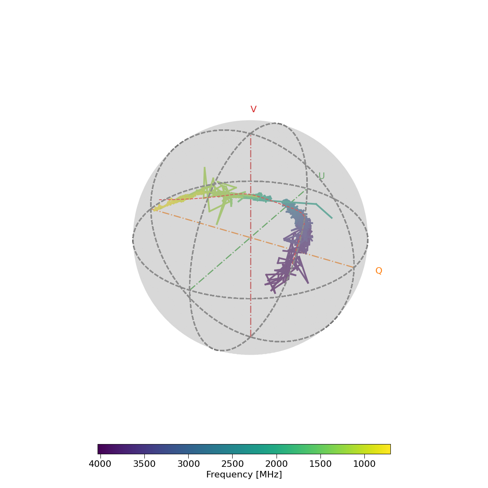
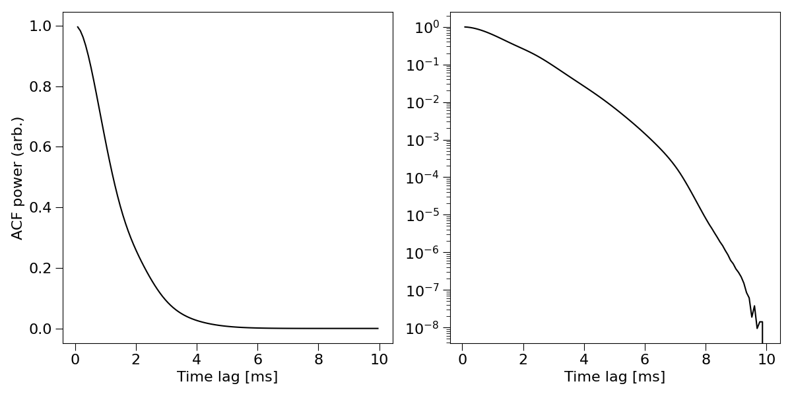
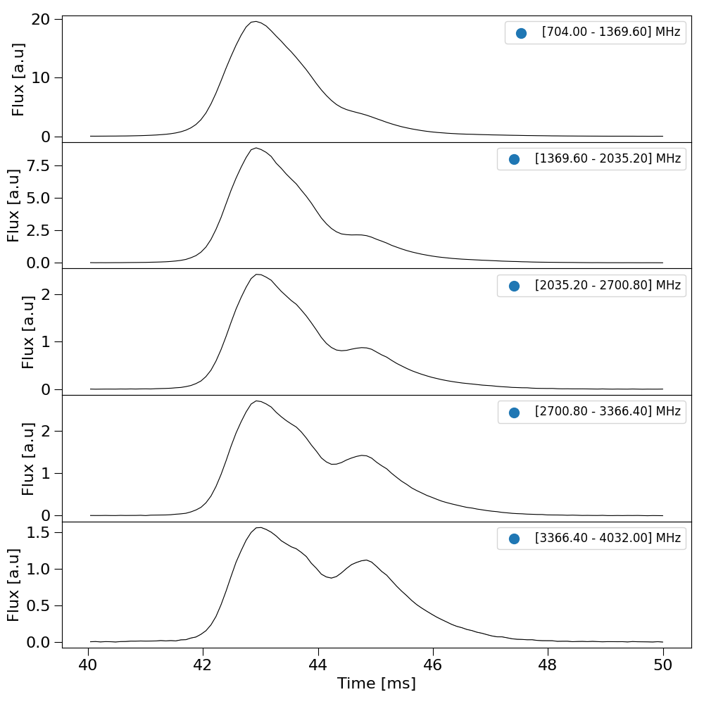

Tutorial 2: Plotting functions
----------

The following is a list of plotting functions that can be used to analyse FRB data. To show an interactive figure set ``show_plots = True`` using frb.set() or setting
it as an argument in any of the plotting methods. To save a ``.png`` of the figure set ``save_plots = True``.

``FRB.plot_data()``
============

The ``FRB.plot_data()`` method is the most generic plotting method in ILEX but also the most versatile by allowing the user
to plot any combination of Stokes data products at once. 

Lets start by plotting the Stokes total intensity data (*I*).

.. code-block:: python

    from ilex.frb import FRB            
    frb = FRB("./examples/VELA240621.yaml")

    frb.plot_data()

We can specify the type of products to plot using the ``data`` argument. Lets plot the total intensity dynspec and Stokes
*I*, *L* and *V* time series profiles. First we will set ``t_crop = [40.0, 50.0]``. We will also change the amount of padding
added to the time crop when plotting the data, i.e. ``plot_tpad = 5.0``.

.. code-block:: python

    frb.set(t_crop = [40.0, 50.0])
    frb.plot_data(data = ['tILV', 'dsI'])

In the above figure the red highlighted region denotes the time crop ``t_crop``.

We can change the layout of the plots in case multiple dynamic spectra are ploted. For example 

.. code-block:: python

    frb.plot_data(data = ['tIQUV', 'dsIQUV', 'fIQUV'], layout = "horizontal")

the ``layout = horizontal`` argument will plot the dynamic spectra along the horizontal direction. The frequency data products, i.e. ``fIQUV``,
will be placed on a single axes on the far right. If ``layout = vertical`` then the time data products will be placed on a single axes on top.

You can also plot stokes fractions! Set ``stk_ratio = True`` to enable this, which requires specifying the off-pulse time crop ``terr_crop``.

.. code-block::python

    frb.set(terr_crop = [20.0, 30.0])
    frb.plot_data(data = ['tILV', 'dsI'], stk_ratio = True, stk_sigma = 3.0)

.. image:: VELAexample_tILV_dsI_ratio.png
   :width: 720pt 

In the code snippet above, ``stk_sigma = 3.0`` will mask any samples with a ``S/N < 3.0`` (signal-to-noise). 

``FRB.plot_PA()``
=================

This method is used to plot the polarisation position angle profile along with stokes data and the total intensity dynamic spectrum. We will need to set
the Rotation Measure ``RM = 39.0``, which is the rough estimated value for Vela.

.. code-block:: python 

    frb.set(RM = 39.0)
    frb.plot_PA(Ldebias_threshold = 3.0, stk2plot = "ILV")

``FRB.plot_poincare()``
=======================

We can plot the Stokes parameters on the poincare sphere.

.. code-block:: python

    frb.plot_poincare(plot_model = True)

The red dashed line shows a polynomial fit of teh poincare track which we enabled using the argument ``plot_model = True``.

``FRB.plot_periodgram()``
=========================

We can plot the periodgram of the total intensity time series (*I*).

.. code-block:: python

    frb.plot_periodgram(plot_log = True)

``FRB.plot_subbands()``
=======================

We can plot Stokes data across multiple subbands.

.. code-block:: python

    frb.plot_subbands(N = 5, stk = "I")

``Additional plotting methods``
===============================

1. ``FRB.plot_crop()``: Plots the bounds of the on-pulse and off-pulse crops, useful for diagnostics.
2. ``FRB.plot_stokes()``: Depreciated method to plot stokes time/frequency data.
3. ``FRB.plot_data_on_axes()``: Method to plot individual Stokes products on a provided axes.
