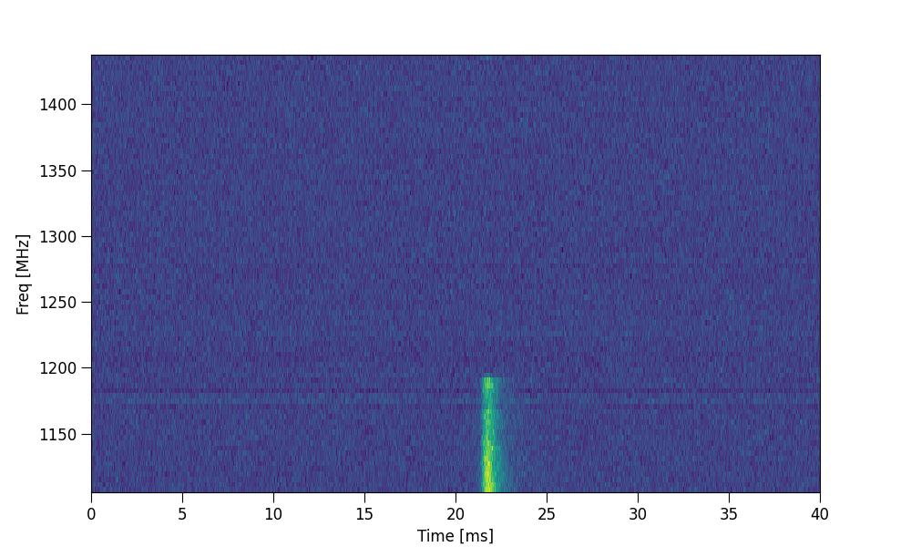
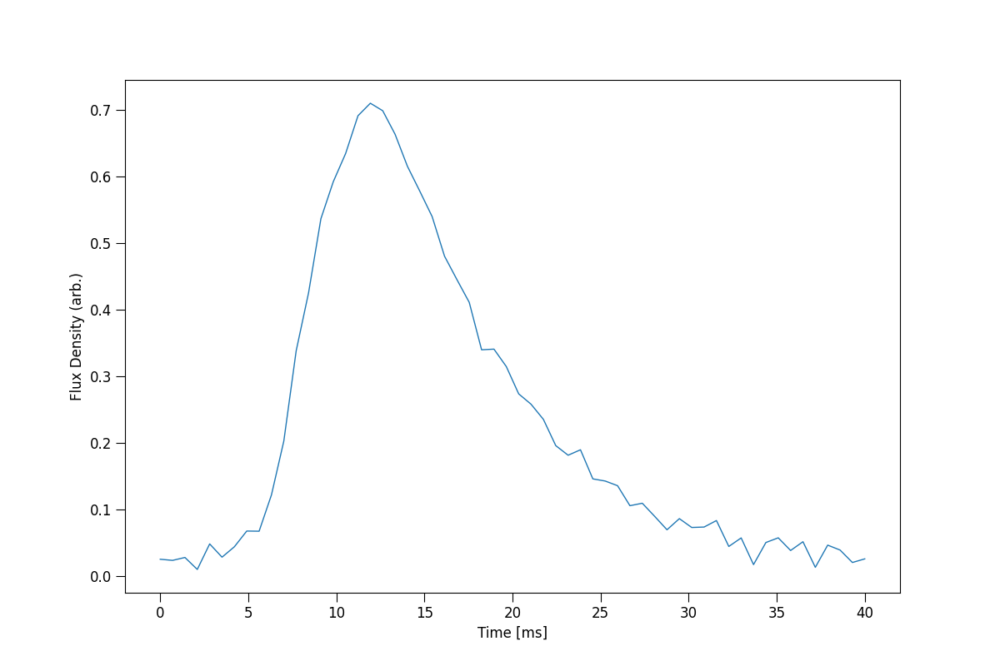

Using ILEX
----------

This brief tutorial will go through an example of using ILEX. The example data being used is an ASKAP observation
of the FRB 20220610A, details of the FRB can be found in the following paper:

https://www.science.org/doi/abs/10.1126/science.adf2678 

Loading data
============

We will start by importing the ilex FRB class, this class holds all the useful functions we will need to study this
FRB.

.. code-block:: python

    from ilex.frb import FRB            
    import matplotlib.pyplot as plt     # for external plotting

Then we will load in our FRB data. Example VELA data can be found in ``examples/``. For now we will load in
the Stokes Power dynamic spectrum, i.e. ``ds_I``

.. code-block:: python

    frb = FRB(name = "FRB220610", cfreq = 1271.5, bw = 336, dt = 50e-3, df = 4)
    frb.load_data(ds_I = "examples/220610_dsI.npy")

In the above code, we initialised an instance of the FRB class. We named the instance ``FRB220610`` and set the 
*central frequency* and *bandwidth* of the observation to ``cfreq = 1271.5 MHz`` and ``bw = 336 MHZ`` respectively. 
The FRB Dynamic spectra example data has a time resolution of ``50us`` and frequency resolution of ``4MHz``.

Cropping and plotting data
==========================

Now that the data is loaded in, we want to plot it. We can do so by simply calling the ``.plot_data()`` method.
Here we are going to plot the full Stokes I dynamic spectrum. Make sure to set either ``show_plots`` or ``save_plots``
to ``True``

.. code-block:: python

    frb.plot_data("dsI", show_plots = True)

Everytime ILEX uses data for plotting etc. a crop is used, since FRBs are very narrow. To define a crop the ``t_crop``
and ``f_crop`` parameters must be specified. By default they are ``["min", "max"]`` which denotes the entire
dynamic spectrum. You can either specify a crop in terms of phase units, or in units of ``ms for t_crop`` and 
``MHz for f_crop`` which can be done by changing ``crop_units``. We can crop the above FRB burst which gives us 
the following plot

.. code-block:: python

    frb.plot_data("dsI", t_crop = [20.9, 23.8], f_crop = [1103.5, 1200])

.. image:: 220610_dsI_crop.png
   :width: 720pt

There are various other plotting functions that ILEX provides, however, for 99% of cases a user may want to create
there own plots. In which case, ILEX can act more like a data container to retrieve processed data for plotting.

processing data and the get_data() function
===========================================

Perhaps the most powerful class method in ILEX is the ``.get_data()`` function. See the documentation for
more avanced usage. As a simple excersise we will retrieve a crop of the above FRB and plot the time series burst profile.

.. code-block:: python

    # get time series profile 
    frb.set(t_crop = [20.9, 23.8], f_crop = [1103.5, 1200])     # set crop params, can also just pass these in the .get_data() method
    tI = frb.get_data(data_list = ["tI"], get = True)['tI']     # get data

    # make x axis array
    x = np.linspace(*frb.par.t_lim, tI.size)

    # plot 
    plt.figure(figsize = (12,8))
    plt.plot(x, tI)
    plt.xlabel("Time [ms]")
    plt.ylabel("Flux Density (arb.)")
    plt.show()

Saving data
===========

Data crops can be saved to file. Note: you do not need to call the ``.get_data()`` since this will be done when
``.save_data()`` is called.

.. code-block:: python

    frb.save_data(data_list = ['tI'])

