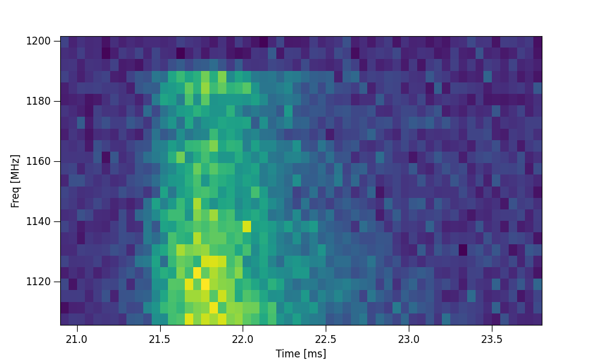
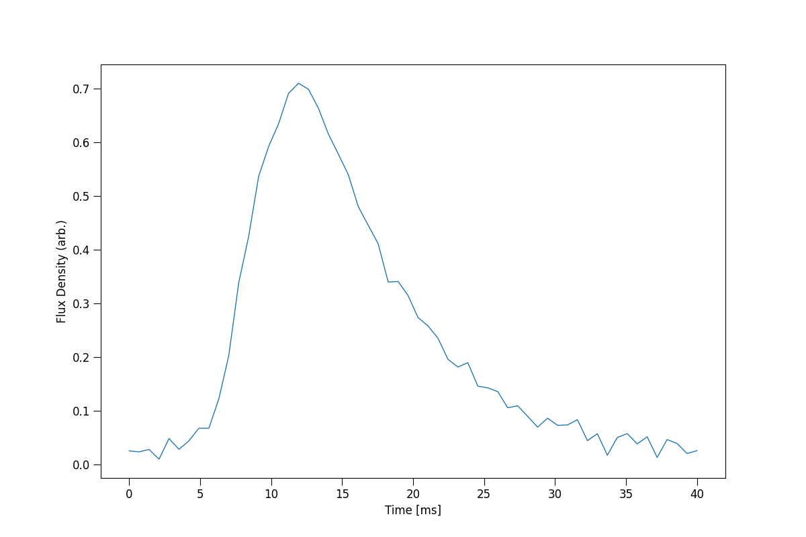

Tutorial 1: Loading and plotting data
----------

This brief tutorial will go through an example of using ILEX. The example data being used is an ASKAP observation
of the FRB 20220610A, details of the FRB can be found in the following paper:

https://www.science.org/doi/abs/10.1126/science.adf2678 

Loading data
============

We will start by importing the ilex FRB class, this class holds all the useful functions we will need to study this
FRB.

.. code-block:: python

    from ilex.frb import FRB            
    import matplotlib.pyplot as plt     # for external plotting

Then we will load in our FRB data. Example data can be found in ``examples/``. For now we will load in
the Stokes Power dynamic spectrum, i.e. ``ds_I``

.. code-block:: python

    frb = FRB(name = "FRB220610", cfreq = 1271.5, bw = 336, dt = 50e-3, df = 4)
    frb.load_data(ds_I = "examples/220610_dsI.npy")

In the above code, we initialised an instance of the FRB class and named the instance ``FRB220610``. FRB220610 has a 
*central frequency* and *bandwidth* of  ``1271.5 MHz`` and ``336 MHz`` respectively, hence we set ``cfreq = 1271.5`` and
``bw = 336``. The data we are loading in has an intrinsic time and frequency resolution of ``50 us`` and ``4 MHz`` respectively,
so we also need to set ``dt = 0.050`` and ``df = 4``. **It is important to note that time and frequency are in units of milliseconds (ms)
and MHz respectively**.

Cropping and plotting data
==========================

Now that the data is loaded in, we want to plot it. We can do so by simply calling the ``.plot_data()`` method.
Here we are going to plot the full Stokes I dynamic spectrum. Make sure to set either ``show_plots`` or ``save_plots``
to ``True`` (``show_plots`` enables interactive windows, ``save_plots`` saves png files of the plots)

.. code-block:: python

    frb.plot_data("dsI", show_plots = True)

.. image:: 220610_dsI.png
   :width: 720pt

Everytime ILEX uses data for plotting, fitting etc. a crop is used, since FRBs are very narrow. To define a crop the ``t_crop``
and ``f_crop`` parameters must be specified. By default they are ``["min", "max"]`` which denotes the entire
dynamic spectrum.

.. code-block:: python

    frb.plot_data("dsI", t_crop = [20.9, 23.8], f_crop = [1103.5, 1200])

There are various other plotting functions that ILEX provides, however, for 99% of cases a user may want to create
there own plots. In which case, ILEX can act more like a data container to retrieve processed data for plotting.

processing data and the get_data() function
===========================================

Perhaps the most powerful class method in ILEX is the ``.get_data()`` method. 
As a simple excersise we will retrieve a crop of the above FRB and plot the stokes I time series profile.

.. code-block:: python

    # get time series profile 
    frb.set(t_crop = [20.9, 23.8], f_crop = [1103.5, 1200])     # set crop params, can also just pass these in the .get_data() method
    tI = frb.get_data(data_list = ["tI"], get = True)['tI']     # get data

    # make x axis array
    x = np.linspace(*frb.par.t_lim, tI.size)

    # plot 
    plt.figure(figsize = (12,8))
    plt.plot(x, tI)
    plt.xlabel("Time [ms]")
    plt.ylabel("Flux Density (arb.)")
    plt.show()

Saving data
===========

Data crops can be saved to file. Note: you do not need to call the ``.get_data()`` method since this will be done when
``.save_data()`` is called.

.. code-block:: python

    frb.save_data(data_list = ['tI'])

This will save a .npy file called ``FRB220610_tI.npy``. Multiple files will be saved depending on the list of data products
provided to the ``.get_data()`` method.

